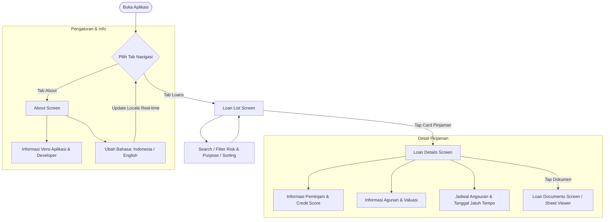

# MyLoanly 🏦

[](https://swift.org)
[](https://developer.apple.com/ios/)
[](https://developer.apple.com/xcode/)
[](https://github.com)
[](LICENSE)

**MyLoanly** adalah aplikasi iOS modern untuk pemantauan dan pengelolaan portofolio pinjaman (P2P Lending / Loan Management). Aplikasi ini dirancang menggunakan **SwiftUI**, **Clean Architecture**, dan **Modular Architecture (Swift Package Manager)** untuk memastikan kode yang *decoupled*, *scalable*, dan mudah diuji (*testable*).

---

## 📌 Daftar Isi
- [Deskripsi Singkat](#-deskripsi-singkat)
- [Key Features](#-key-features)
- [Arsitektur Overview](#-arsitektur-overview)
- [Preview Flow](#-preview-flow)
- [Preview Table (Screenshots)](#-preview-table-screenshots)
- [Tech Stack & Library](#-tech-stack--library)
- [Requirements](#-requirements)
- [Build Schemes & Environment](#-build-schemes--environment)
- [Running Unit Tests](#-running-unit-tests)
- [Struktur Proyek](#-struktur-proyek)

---

## 📖 Deskripsi Singkat

**MyLoanly** memberikan pengalaman intuitif bagi pengguna untuk melihat daftar pinjaman aktif, melakukan filter dan pencarian komprehensif, menganalisis profil risiko dan riwayat peminjam (*borrower*), memeriksa jadwal angsuran (*repayment schedule*), hingga melihat dokumen verifikasi pinjaman secara langsung melalui *in-app document viewer*.

Aplikasi ini juga dilengkapi dengan dukungan multi-bahasa (*dynamic localization*) dan *built-in developer debug tools* untuk kemudahan *monitoring* performa saat pengembangan.

---

## ✨ Key Features

1. **Loan Catalog & Exploration**
   - Pencarian cerdas berdasarkan nama peminjam (*borrower name*) atau tujuan pinjaman (*loan purpose*).
   - Filter cepat berdasarkan **Tingkat Risiko / Risk Rating** (Rating A, B, C, D).
   - Filter berdasarkan **Tujuan Pinjaman / Purpose** (*Business Expansion, Equipment Purchase, Inventory Financing, Working Capital*).
   - Menu Sorting fleksibel (berdasarkan Nominal Pinjaman, Suku Bunga, Tenor, dan Tanggal).

2. **Portfolio Summary & Aggregator**
   - Ringkasan total akumulasi nominal pinjaman aktif (*Total Active Loans*).
   - Penghitung total unit pinjaman aktif yang sedang berjalan.

3. **Comprehensive Loan Details**
   - **Overview Card**: Nominal pinjaman, suku bunga tahunan, durasi/tenor, dan badge tingkat risiko.
   - **Borrower Information**: Nama, kontak email, dan skor kredit (*credit score*) lengkap dengan kategori tier (*Excellent, Good, Fair*).
   - **Collateral Details**: Jenis agunan/jaminan dan estimasi valuasi aset.
   - **Repayment Schedule**: Daftar rincian jadwal cicilan angsuran (*installments*) beserta tanggal jatuh tempo (*due date*).

4. **In-App Document Viewer**
   - Pratinjau dokumen legal/verifikasi pinjaman (*Income Statement, Tax Return, Bank Statements, Business Registration, Collateral Deed*) dengan *sheet modal viewer*.

5. **In-App Localization (Multi-Bahasa Dinamis)**
   - Mendukung **Bahasa Indonesia (ID)** dan **English (US)**.
   - Perubahan bahasa dapat dilakukan langsung di menu Pengaturan (*About Screen*) secara *real-time* tanpa perlu memulai ulang (*restart*) aplikasi.

6. **In-App Debugger & Network Profiler (Debug Mode)**
   - Integrasi `DebugSwift` pada skema *Development/Debug* untuk memonitor *network request/response*, konsumsi memori (*memory leak detection*), dan *performance profiler*.

---

## 🏛 Arsitektur Overview

MyLoanly dibangun dengan pola **Clean Architecture + Modular Swift Packages (SPM) + MVVM-R (Router)**:

```
┌────────────────────────────────────────────────────────┐
│               Presentation Layer (App Target)          │
│   SwiftUI Views • ViewModels • Routers • Localization  │
└───────────────────────────┬────────────────────────────┘
                            │ (depends on)
                            ▼
┌────────────────────────────────────────────────────────┐
│               Data Layer (PackageData SPM)             │
│   HTTPClient • CoreRepositoryImpl • API DTOs • Network │
└───────────────────────────┬────────────────────────────┘
                            │ (implements & depends on)
                            ▼
┌────────────────────────────────────────────────────────┐
│              Domain Layer (CoreDomain SPM)             │
│   Entities • Models • Use Cases • Repository Contracts │
│             (Pure Swift - Zero External Deps)          │
└────────────────────────────────────────────────────────┘
```

### Modul & Tanggung Jawab:

1. **`CoreDomain` (Swift Package - Pure Swift & macOS/iOS compatible)**
   - Berisi entitas murni: `Loan`, `Borrower`, `Collateral`, `RepaymentSchedule`, `Money`, `LoanTerm`.
   - Business Logic & Use Case: `GetLoansUseCase`.
   - Repository Protocol: `CoreRepository`.
   - Bebas dari dependensi UI (*framework-agnostic*).

2. **`PackageData` (Swift Package)**
   - Mengimplementasikan `CoreRepository` melalui `CoreRepositoryImpl`.
   - Abstraksi jaringan: `HTTPClient` dan `URLSessionHTTPClient`.
   - Serialisasi DTO JSON & error handling.

3. **`MyLoanly` (Main iOS Application Target)**
   - **Presentation**: SwiftUI Views (`LoanListScreen`, `LoanDetailsScreen`, `LoanDocumentsScreen`, `AboutScreen`).
   - **ViewModels**: Menangani *state management* (`@MainActor`, `ObservableObject`, `Async/Await`).
   - **Router**: Pengelolaan navigasi berbasis `NavigationStack` (`LoanNavigationRouter`).
   - **Config & Localization**: `AppLanguageManager`, `AppConfig`, `AppColors`.

---

## 🔄 Preview Flow



---

## 📱 Preview Table (Screenshots)

Berikut adalah template tampilan antarmuka (*user interface*) aplikasi **MyLoanly**:

| Screen / Fitur | Light Mode | Dark Mode | Deskripsi |
| :--- | :---: | :---: | :--- |
| **Loan List Screen** |  |  | Menampilkan daftar pinjaman aktif, ringkasan total portofolio, search bar, chip filter risiko & tujuan pinjaman, serta menu sorting. |
| **Loan Details Screen** |  |  | Rincian lengkap nominal, suku bunga, data peminjam & credit rating badge, agunan, dan tabel jadwal cicilan. |
| **Loan Documents Screen** |  |  | Daftar berkas verifikasi dan pratinjau dokumen legal / finansial melalui in-app viewer. |
| **About & Settings Screen** |  |  | Informasi pengembang, versi rilis aplikasi, dan pemilih bahasa (*Localization Switcher*). |

> 💡 *Catatan: Letakkan file tangkapan layar pada folder `docs/screenshots/` dengan nama file yang sesuai.*

---

## 🛠 Tech Stack & Library

| Kategori | Teknologi / Library | Keterangan |
| :--- | :--- | :--- |
| **Language** | Swift 6.0 | Menggunakan fitur Swift Concurrency terbaru (`async/await`, `Sendable`, `@MainActor`). |
| **UI Framework** | SwiftUI & WebKit | Declarative UI dengan NavigationStack & WebKit viewer. |
| **Architecture** | Clean Architecture + Modular SPM | Pemisahan domain murni, data infra, dan layer presentasi. |
| **Dependency Manager**| Swift Package Manager (SPM) | Native SPM untuk local package & third-party libraries. |
| **Third-Party Library** | [DebugSwift](https://github.com/DebugSwift/DebugSwift) (`v1.19.0`) | In-app performance profiling, network inspector, dan memory leak detector (Debug build). |
| **Unit Testing** | XCTest | Pengujian menyeluruh pada Use Cases, ViewModels, Repository, dan Localization. |

---

## 📋 Requirements

Sebelum menjalankan proyek, pastikan lingkungan pengembangan Anda memenuhi spesifikasi berikut:

- **macOS**: Sonoma (14.0+) atau Sequoia (15.0+)
- **Xcode**: Versi 16.0 atau lebih baru
- **Swift**: 6.0+
- **iOS Deployment Target**: iOS 16.0+
- **Simulator / Device**: iPhone dengan iOS 16.0+

---

## ⚙️ Build Schemes & Environment

Proyek ini menggunakan konfigurasi multi-environment berbasis `.xcconfig` di folder `XCConfig/`:

| Scheme Name | Build Configuration | Bundle Identifier | Endpoint API / Kegunaan |
| :--- | :--- | :--- | :--- |
| **`MyLoanly-Development`** | `Debug-Development` | `com.dhikadityre.myloanly.Development` | Lingkungan pengembangan lokal + DebugSwift aktif. |
| **`MyLoanly-Staging`** | `Debug-Staging` / `Release-Staging` | `com.dhikadityre.myloanly.Staging` | Lingkungan pengujian internal / QA team. |
| **`MyLoanly-UAT`** | `Debug-UAT` / `Release-UAT` | `com.dhikadityre.myloanly.UAT` | Lingkungan pengujian User Acceptance Testing. |
| **`MyLoanly-Production`** | `Debug-Production` / `Release-Production` | `com.dhikadityre.myloanly` | Lingkungan produksi live / App Store release. |
| **`CoreDomain`** | Debug / Release | *SPM Library* | Modul murni Domain Logic (mendukung macOS & iOS). |
| **`PackageData`** | Debug / Release | *SPM Library* | Modul Data Jaringan & Repository (mendukung macOS & iOS). |

---

## 🧪 Running Unit Tests

Proyek ini dirancang agar pengujian unit test dapat dijalankan dengan **sangat cepat** melalui pemisahan modul SPM.

### 1. ⚡ Versi Cepat (Fast Execution via macOS Target / CLI)
Karena modul `CoreDomain` dan `PackageData` adalah pustaka Swift murni tanpa dependensi UIKit/iOS Simulator, unit test dapat dieksekusi langsung pada target **macOS** (hanya memerlukan waktu < 1 detik):

#### Menjalankan Test `CoreDomain` via Swift CLI:
```bash
cd CoreDomain
swift test
```

#### Menjalankan Test `PackageData` via macOS Destination:
```bash
xcodebuild test \
  -scheme PackageData \
  -destination 'platform=macOS'
```

#### Menjalankan Test `CoreDomain` via Xcodebuild:
```bash
xcodebuild test \
  -scheme CoreDomain \
  -destination 'platform=macOS'
```

---

### 2. 📱 Versi Simulator (Presentation & ViewModel Tests)
Untuk menguji layer presentasi (`MyLoanlyTests`), ViewModel, dan Localization yang memiliki dependensi lingkungan iOS:

```bash
xcodebuild test \
  -scheme MyLoanly-Development \
  -destination 'platform=iOS Simulator,name=iPhone 16 Pro'
```

---

### 3. ⌨️ Menjalankan Langsung dari Xcode IDE
- Buka `MyLoanly.xcodeproj` di Xcode.
- Pilih Scheme yang ingin diuji (misal: `MyLoanly-Development`, `CoreDomain`, atau `PackageData`).
- Tekan shortcut **`Cmd + U`** untuk menjalankan semua test suite.

---

## 📁 Struktur Proyek

```text
MyLoanly/
├── CoreDomain/                 # [SPM] Modul Domain Layer (Entities, UseCases, Repo Contracts)
│   ├── Sources/CoreDomain/
│   │   ├── Model/             # Loan, Borrower, Collateral, Money, dsb.
│   │   ├── Repositories/      # CoreRepository Protocol
│   │   └── UseCase/           # GetLoansUseCase
│   └── Tests/CoreDomainTests/ # Unit Tests untuk Use Case & Models
│
├── PackageData/                # [SPM] Modul Data Layer (Network, DTO, Repo Implementation)
│   ├── Sources/PackageData/
│   │   ├── Infra/             # HTTPClient, URLSessionHTTPClient
│   │   ├── Services/          # CoreRepositoryImpl
│   │   └── Utilities/         # Logger & Helper
│   └── Tests/PackageDataTests/# Unit Tests untuk Repository & Network
│
├── MyLoanly/                   # [App Target] Presentation & App Lifecycle
│   ├── App/
│   │   ├── Config/            # AppConfig & AppLanguageManager
│   │   ├── AppDelegate.swift  # DebugSwift configuration
│   │   └── MyLoanlyApp.swift  # SwiftUI App Entry Point
│   ├── Presentation/
│   │   ├── Components/        # Reusable UI (LoanCardView, RiskBadgeView, FilterChip)
│   │   ├── Extensions/        # View styling modifiers
│   │   ├── Screen/
│   │   │   ├── Loan/          # LoanList, LoanDetails, LoanDocuments, Router
│   │   │   └── About/         # AboutScreen, SettingsRowView
│   │   └── Theme/             # AppColors & Design Tokens
│   └── Assets.xcassets/       # Color assets & icon resources
│
├── MyLoanlyTests/              # Unit Tests untuk ViewModels & Localization
│   ├── LocalizationTests.swift
│   └── ViewModels/            # LoanList, LoanDetails, AboutScreen ViewModel Tests
│
├── XCConfig/                   # Environment configuration files (.xcconfig)
│   ├── Base.xcconfig
│   ├── Development.xcconfig
│   ├── Staging.xcconfig
│   ├── UAT.xcconfig
│   └── Production.xcconfig
│
├── MyLoanly.xcodeproj          # Xcode Project file
└── README.md                   # Dokumentasi Utama Proyek
```

---

## 👨‍💻 Author & Maintainer
- **Dhika Aditya Are**
- Repository: [MyLoanly](https://github.com/dhikadityre/MyLoanly)
