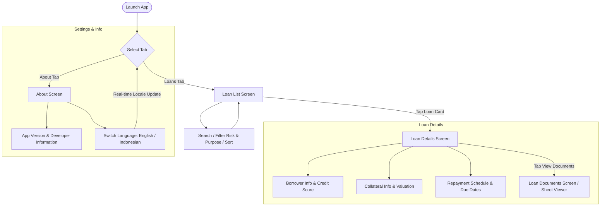

# MyLoanly 🏦

[](https://swift.org)
[](https://developer.apple.com/ios/)
[](https://developer.apple.com/xcode/)
[](https://github.com)
[](LICENSE)

**MyLoanly** is a modern iOS application for loan portfolio monitoring and peer-to-peer (P2P) lending management. Built with **SwiftUI**, **Clean Architecture**, and **Modular Swift Packages (SPM)**, it ensures a decoupled, scalable, and highly testable codebase.

---

## 📌 Table of Contents
- [Overview](#-overview)
- [Key Features](#-key-features)
- [Architecture Overview](#-architecture-overview)
- [Application Flow](#-application-flow)
- [Preview Table (Screenshots)](#-preview-table-screenshots)
- [Tech Stack & Dependencies](#-tech-stack--dependencies)
- [Requirements](#-requirements)
- [Build Schemes & Environments](#-build-schemes--environments)
- [Running Unit Tests](#-running-unit-tests)
- [Project Structure](#-project-structure)
- [Author & Maintainer](#-author--maintainer)

---

## 📖 Overview

**MyLoanly** provides an intuitive user experience for exploring active loan listings, applying comprehensive filters and search queries, analyzing borrower risk profiles and credit scores, inspecting repayment installment schedules, and previewing verified loan documents directly via an in-app viewer.

The app also features dynamic multi-language support (localization) and built-in developer debugging tools for real-time performance and network monitoring during development.

---

## ✨ Key Features

1. **Loan Catalog & Exploration**
   - Smart search by borrower name or loan purpose.
   - Quick filtering by **Risk Rating** (A, B, C, D).
   - Filtering by **Loan Purpose** (*Business Expansion, Equipment Purchase, Inventory Financing, Working Capital*).
   - Flexible sorting options (by Loan Amount, Interest Rate, Term Duration, or Date).

2. **Portfolio Summary & Aggregator**
   - Real-time aggregated summary of total active loan amounts (*Total Active Loans*).
   - Real-time counter of total active loan listings.

3. **Comprehensive Loan Details**
   - **Overview Card**: Loan amount, annual interest rate, duration/term, and risk rating badge.
   - **Borrower Information**: Name, contact email, credit score, and color-coded tiering (*Excellent, Good, Fair*).
   - **Collateral Details**: Collateral asset type and estimated market valuation.
   - **Repayment Schedule**: Detailed breakdown of installments and upcoming due dates.

4. **In-App Document Viewer**
   - Inspect legal and financial verification documents (*Income Statement, Tax Return, Bank Statements, Business Registration, Collateral Deed*) via a modal sheet viewer.

5. **Dynamic In-App Localization**
   - Supports **English (US)** and **Indonesian (ID)**.
   - Switch languages on-the-fly directly from the Settings / About screen without restarting the application.

6. **In-App Developer Debugger & Network Profiler (Debug Mode)**
   - Integrated with `DebugSwift` in development builds for real-time HTTP traffic inspection, memory leak detection, and performance profiling.

---

## 🏛 Architecture Overview

MyLoanly follows **Clean Architecture + Modular Swift Packages (SPM) + MVVM-R (Router)** principles:

```
┌────────────────────────────────────────────────────────┐
│               Presentation Layer (App Target)          │
│   SwiftUI Views • ViewModels • Routers • Localization  │
└───────────────────────────┬────────────────────────────┘
                            │ (depends on)
                            ▼
┌────────────────────────────────────────────────────────┐
│               Data Layer (PackageData SPM)             │
│   HTTPClient • CoreRepositoryImpl • API DTOs • Network │
└───────────────────────────┬────────────────────────────┘
                            │ (implements & depends on)
                            ▼
┌────────────────────────────────────────────────────────┐
│              Domain Layer (CoreDomain SPM)             │
│   Entities • Models • Use Cases • Repository Contracts │
│             (Pure Swift - Zero External Deps)          │
└────────────────────────────────────────────────────────┘
```

### Modules & Responsibilities:

1. **`CoreDomain` (Swift Package - Pure Swift, macOS & iOS compatible)**
   - Pure Domain Entities: `Loan`, `Borrower`, `Collateral`, `RepaymentSchedule`, `Money`, `LoanTerm`.
   - Business Logic & Use Cases: `GetLoansUseCase`.
   - Repository Protocol: `CoreRepository`.
   - Framework-agnostic with zero third-party or UI dependencies.

2. **`PackageData` (Swift Package)**
   - Implements `CoreRepository` via `CoreRepositoryImpl`.
   - Networking abstractions: `HTTPClient` and `URLSessionHTTPClient`.
   - JSON DTO serialization, domain mapping, and error handling.

3. **`MyLoanly` (Main iOS Application Target)**
   - **Presentation**: SwiftUI Views (`LoanListScreen`, `LoanDetailsScreen`, `LoanDocumentsScreen`, `AboutScreen`).
   - **ViewModels**: State management adhering to Swift Concurrency (`@MainActor`, `ObservableObject`, `async/await`).
   - **Router**: Centralized navigation flow using `NavigationStack` (`LoanNavigationRouter`).
   - **Config & Localization**: `AppLanguageManager`, `AppConfig`, `AppColors`.

---

## 🔄 Application Flow



---

## 📱 Preview Table (Screenshots)

Below is the user interface preview template for **MyLoanly**:

| Screen / Feature | Light Mode | Dark Mode | Description |
| :--- | :---: | :---: | :--- |
| **Loan List Screen** |  |  | Displays active loan cards, portfolio summary header, search bar, risk & purpose filter chips, and sort menu. |
| **Loan Details Screen** |  |  | In-depth breakdown of loan amount, interest rate, borrower information, credit score tiering, collateral, and repayment installments. |
| **Loan Documents Screen** |  |  | Verified document checklist with modal sheet previews for legal and financial files. |
| **About & Settings Screen** |  |  | App release metadata, developer portfolio links, and dynamic in-app language picker. |

> 💡 *Note: Place your screenshot assets into the `docs/screenshots/` directory matching the designated filenames.*

---

## 🛠 Tech Stack & Dependencies

| Category | Technology / Library | Description |
| :--- | :--- | :--- |
| **Language** | Swift 6.0 | Modern Swift Concurrency (`async/await`, `Sendable`, `@MainActor`). |
| **UI Framework** | SwiftUI & WebKit | Declarative UI with `NavigationStack` & WebKit document viewer. |
| **Architecture** | Clean Architecture + Modular SPM | Clean separation of pure domain logic, data infra, and presentation. |
| **Dependency Manager**| Swift Package Manager (SPM) | Native SPM for local modular packages and external dependencies. |
| **Third-Party Library** | [DebugSwift](https://github.com/DebugSwift/DebugSwift) (`v1.19.0`) | In-app performance profiling, network inspector, and memory leak detector (Debug builds). |
| **Unit Testing** | XCTest | Comprehensive test coverage across Use Cases, ViewModels, Repositories, and Localization. |

---

## 📋 Requirements

Before building the project, ensure your development environment meets the following specifications:

- **macOS**: Sonoma (14.0+) or Sequoia (15.0+)
- **Xcode**: Version 16.0 or later
- **Swift**: 6.0+
- **iOS Deployment Target**: iOS 16.0+
- **Simulator / Physical Device**: iPhone running iOS 16.0+

---

## ⚙️ Build Schemes & Environments

The project utilizes multi-environment build configurations driven by `.xcconfig` files located in `XCConfig/`:

| Scheme Name | Build Configuration | Bundle Identifier | API Endpoint / Purpose |
| :--- | :--- | :--- | :--- |
| **`MyLoanly-Development`** | `Debug-Development` | `com.dhikadityre.myloanly.Development` | Local development environment with DebugSwift enabled. |
| **`MyLoanly-Staging`** | `Debug-Staging` / `Release-Staging` | `com.dhikadityre.myloanly.Staging` | Internal QA testing and staging validation. |
| **`MyLoanly-UAT`** | `Debug-UAT` / `Release-UAT` | `com.dhikadityre.myloanly.UAT` | User Acceptance Testing environment. |
| **`MyLoanly-Production`** | `Debug-Production` / `Release-Production` | `com.dhikadityre.myloanly` | Production release environment for the App Store. |
| **`CoreDomain`** | Debug / Release | *SPM Library* | Pure Domain Logic package (supports macOS & iOS). |
| **`PackageData`** | Debug / Release | *SPM Library* | Data Networking & Repository package (supports macOS & iOS). |

---

## 🧪 Running Unit Tests

The modular architecture enables **ultra-fast test execution** for core packages without requiring an iOS Simulator.

### 1. ⚡ Fast Execution (macOS Target / Swift Package CLI)
Because `CoreDomain` and `PackageData` are pure Swift/Foundation libraries with macOS support, their tests execute natively on **macOS** in less than a second:

#### Run `CoreDomain` tests via Swift CLI:
```bash
cd CoreDomain
swift test
```

#### Run `PackageData` tests via macOS destination:
```bash
xcodebuild test \
  -scheme PackageData \
  -destination 'platform=macOS'
```

#### Run `CoreDomain` tests via Xcodebuild:
```bash
xcodebuild test \
  -scheme CoreDomain \
  -destination 'platform=macOS'
```

---

### 2. 📱 Simulator Tests (Presentation & ViewModel Layer)
To test the presentation layer (`MyLoanlyTests`), ViewModels, and Localization on an iOS Simulator:

```bash
xcodebuild test \
  -scheme MyLoanly-Development \
  -destination 'platform=iOS Simulator,name=iPhone 16 Pro'
```

---

### 3. ⌨️ Running from Xcode IDE
- Open `MyLoanly.xcodeproj` in Xcode.
- Select the desired Scheme (e.g., `MyLoanly-Development`, `CoreDomain`, or `PackageData`).
- Press **`Cmd + U`** to execute all tests.

---

## 📁 Project Structure

```text
MyLoanly/
├── CoreDomain/                 # [SPM] Domain Layer (Entities, Use Cases, Repo Protocols)
│   ├── Sources/CoreDomain/
│   │   ├── Model/             # Loan, Borrower, Collateral, Money, etc.
│   │   ├── Repositories/      # CoreRepository Protocol
│   │   └── UseCase/           # GetLoansUseCase
│   └── Tests/CoreDomainTests/ # Unit Tests for Use Cases & Models
│
├── PackageData/                # [SPM] Data Layer (Networking, DTOs, Repo Implementation)
│   ├── Sources/PackageData/
│   │   ├── Infra/             # HTTPClient, URLSessionHTTPClient
│   │   ├── Services/          # CoreRepositoryImpl
│   │   └── Utilities/         # Logger & Helper utilities
│   └── Tests/PackageDataTests/# Unit Tests for Repository & Network Client
│
├── MyLoanly/                   # [App Target] Presentation & App Lifecycle
│   ├── App/
│   │   ├── Config/            # AppConfig & AppLanguageManager
│   │   ├── AppDelegate.swift  # DebugSwift setup
│   │   └── MyLoanlyApp.swift  # SwiftUI App Entry Point
│   ├── Presentation/
│   │   ├── Components/        # Reusable UI (LoanCardView, RiskBadgeView, FilterChip)
│   │   ├── Extensions/        # View styling modifiers & color tokens
│   │   ├── Screen/
│   │   │   ├── Loan/          # LoanList, LoanDetails, LoanDocuments, NavigationRouter
│   │   │   └── About/         # AboutScreen, SettingsRowView
│   │   └── Theme/             # AppColors & Design Tokens
│   └── Assets.xcassets/       # Color assets & icon resources
│
├── MyLoanlyTests/              # Presentation & ViewModel Unit Tests
│   ├── LocalizationTests.swift
│   └── ViewModels/            # LoanList, LoanDetails, AboutScreen ViewModel Tests
│
├── XCConfig/                   # Environment configuration files (.xcconfig)
│   ├── Base.xcconfig
│   ├── Development.xcconfig
│   ├── Staging.xcconfig
│   ├── UAT.xcconfig
│   └── Production.xcconfig
│
├── MyLoanly.xcodeproj          # Xcode Project file
└── README.md                   # Primary Project Documentation
```

---

## 👨‍💻 Author & Maintainer
- **Dhika Aditya Are**
- Repository: [MyLoanly](https://github.com/dhikadityre/MyLoanly)
